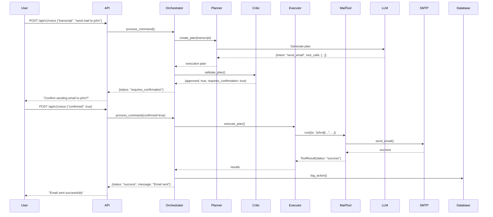

# Astra Architecture Documentation

## Overview

Astra is a voice-first agentic AI assistant built with a multi-agent architecture. This document explains the system design, components, and data flow.

## System Architecture

```
┌─────────────────────────────────────────────────────────────────┐
│                         Client Layer                             │
│  ┌──────────────┐    ┌──────────────┐    ┌──────────────┐      │
│  │   Electron   │    │     Web      │    │    Mobile    │      │
│  │   Desktop    │    │   Browser    │    │     App      │      │
│  └──────────────┘    └──────────────┘    └──────────────┘      │
└─────────────────────────────────────────────────────────────────┘
                              │
                              ▼
┌─────────────────────────────────────────────────────────────────┐
│                        API Gateway                               │
│                     (FastAPI / REST)                             │
│  ┌──────────────────────────────────────────────────────────┐  │
│  │  /health  │  /api/v1/voice  │  /api/v1/command  │ /docs │  │
│  └──────────────────────────────────────────────────────────┘  │
└─────────────────────────────────────────────────────────────────┘
                              │
                              ▼
┌─────────────────────────────────────────────────────────────────┐
│                   Agent Orchestrator                             │
│  ┌──────────────────────────────────────────────────────────┐  │
│  │  1. Perception  →  2. Memory  →  3. Planner  →          │  │
│  │  4. Critic  →  5. Executor                               │  │
│  └──────────────────────────────────────────────────────────┘  │
└─────────────────────────────────────────────────────────────────┘
          │              │              │              │
          ▼              ▼              ▼              ▼
    ┌─────────┐    ┌─────────┐    ┌─────────┐    ┌─────────┐
    │   LLM   │    │ Memory  │    │  Tools  │    │  Logs   │
    │ Adapter │    │ Service │    │Registry │    │ & Audit │
    └─────────┘    └─────────┘    └─────────┘    └─────────┘
          │              │              │              │
          ▼              ▼              ▼              ▼
    ┌─────────────────────────────────────────────────────────┐
    │              Infrastructure Layer                        │
    │  ┌──────────┐  ┌──────────┐  ┌──────────┐  ┌────────┐ │
    │  │PostgreSQL│  │  Redis   │  │  SMTP    │  │External│ │
    │  │+pgvector │  │  Queue   │  │ Server   │  │   APIs │ │
    │  └──────────┘  └──────────┘  └──────────┘  └────────┘ │
    └─────────────────────────────────────────────────────────┘
```

## Core Components

### 1. API Gateway (FastAPI)

**Purpose**: HTTP/REST API entry point for all client requests.

**Endpoints**:
- `GET /health` - Health check
- `GET /ready` - Readiness probe
- `POST /api/v1/voice` - Process voice command
- `POST /api/v1/command` - Process text command
- `GET /docs` - Interactive API documentation (Swagger)

**Responsibilities**:
- Request validation
- Authentication (JWT)
- Rate limiting
- Request routing to orchestrator

### 2. Agent Orchestrator

**Purpose**: Coordinates the multi-agent workflow to process user requests.

**Pipeline Stages**:

1. **Perception**: Normalizes and parses user input
2. **Memory Retrieval**: Fetches relevant context and historical data
3. **Planner**: Creates execution plan with tool calls
4. **Critic**: Validates plan for safety and permissions
5. **Executor**: Runs approved tools and actions

**Key Features**:
- Asynchronous processing
- Context management
- Error handling and recovery
- Action logging

### 3. Agents

#### Planner Agent
- Analyzes user requests
- Selects appropriate tools
- Generates structured execution plan
- Uses LLM for intent understanding

#### Critic Agent
- Validates execution plans
- Checks safety constraints
- Enforces permission policies
- Flags dangerous operations

#### Executor Agent
- Runs validated tool calls
- Handles tool errors
- Returns structured results
- Logs all executions

### 4. LLM Adapter

**Purpose**: Abstracts LLM provider interactions.

**Supported Providers**:
- Local LLMs (via Ollama/llama.cpp)
- Krutrim API (cloud)
- OpenAI (optional)

**Features**:
- Provider switching
- Fallback mechanisms
- Prompt templating
- Response parsing

### 5. Tool System

**Architecture**:
```python
BaseTool (Abstract)
├── MailSendTool
├── WebSearchTool
├── FileOpsTool (future)
└── SystemExecTool (future)
```

**Tool Interface**:
```python
class BaseTool:
    def validate(args) -> (bool, message)
    def run(args, user_context) -> ToolResult
    def get_schema() -> dict
```

**Tool Registry**:
- Centralized tool management
- Dynamic tool discovery
- Permission mapping
- Schema generation for LLM

### 6. Memory Service

**Purpose**: Persistent storage and retrieval of conversations and facts.

**Components**:
- **PostgreSQL**: Relational data (users, messages, logs)
- **pgvector**: Vector embeddings for semantic search
- **Redis**: Caching and session management

**Database Schema**:
```
users
├── id (UUID)
├── username
├── email
└── hashed_password

messages
├── id (UUID)
├── user_id (FK)
├── role (user/assistant/system)
├── text
├── context_id
└── created_at

memories
├── id (UUID)
├── user_id (FK)
├── text
├── embedding_vector (pgvector)
├── tags
└── created_at

action_logs
├── id (UUID)
├── user_id (FK)
├── action_type
├── payload
├── confirmed_by_user
├── status
└── created_at
```

## Data Flow

### Example: Send Email Flow



## Security Architecture

### Authentication & Authorization

1. **JWT Tokens**: User authentication
2. **Per-Tool Permissions**: Granular access control
3. **Confirmation Flow**: Explicit approval for sensitive actions

### Safety Mechanisms

1. **Critic Agent Validation**: All plans reviewed before execution
2. **Sandboxing**: System commands run in isolated containers
3. **Audit Trail**: Immutable log of all actions
4. **Rate Limiting**: Prevent abuse and runaway loops

### Permission Model

```python
Permissions:
- mail.send
- search.web
- file.read
- file.write
- system.exec:sandbox
- system.exec:unsafe (requires elevated approval)
```

## Configuration

### Environment Variables

```bash
# Database
DATABASE_URL=postgresql://...

# LLM Provider
LLM_PROVIDER=local|krutrim
KRUTRIM_API_KEY=...

# SMTP
SMTP_HOST=smtp.gmail.com
SMTP_USER=...
SMTP_PASSWORD=...

# Security
SECRET_KEY=...
JWT_ALGORITHM=HS256
```

### Feature Flags

Future support for:
- `ENABLE_VOICE_INPUT`
- `ENABLE_TTS_OUTPUT`
- `ENABLE_MULTI_AGENT_DEBATE`
- `ENABLE_ANALYTICS`

## Deployment

### Docker Compose (Development)

```yaml
services:
  - postgres (with pgvector)
  - redis
  - api (FastAPI)
```

### Production

- **Container Orchestration**: Kubernetes or Docker Swarm
- **Load Balancing**: Nginx or cloud load balancer
- **Database**: Managed PostgreSQL (AWS RDS, etc.)
- **Monitoring**: Prometheus + Grafana
- **Logging**: ELK stack or cloud logging

## Scaling Considerations

### Horizontal Scaling
- Stateless API servers
- Session affinity via Redis
- Database connection pooling

### Performance Optimization
- Redis caching for frequent queries
- Async I/O for all external calls
- Background job processing for long-running tasks
- Vector index optimization for memory retrieval

## Future Enhancements

### Phase 2 (Month 2)
- Vector memory with semantic search
- Web search tool integration
- Reminder scheduling system
- Analytics dashboard

### Phase 3 (Month 3)
- Multi-agent debate system
- Productivity analytics
- Voice mood detection
- Coding assistant capabilities
- IoT integration (MQTT)

## API Versioning

Current: `v1`

Future versions will maintain backward compatibility:
- `/api/v1/*` - Current API
- `/api/v2/*` - Future enhancements
- Deprecation notices in headers

## Error Handling Strategy

1. **Validation Errors**: Return 400 with detailed message
2. **Authentication Errors**: Return 401/403
3. **Tool Execution Errors**: Return 200 with error in result
4. **System Errors**: Return 500, log to monitoring
5. **LLM Errors**: Fallback to simple intent parser

## Monitoring & Observability

### Health Checks
- `/health` - Comprehensive health status
- `/ready` - Kubernetes readiness probe

### Metrics (Future)
- Request latency (p50, p95, p99)
- Error rates by endpoint
- Tool execution success rate
- LLM response time
- Database query performance

### Logging
- Structured JSON logs
- Request/response tracing
- Audit trail for all actions
- Error stack traces

## Development Workflow

1. **Local Development**: Docker Compose
2. **Testing**: pytest with test database
3. **Linting**: black, flake8
4. **CI/CD**: GitHub Actions (future)
5. **Deployment**: Docker images to registry

## Documentation

- **README.md**: Quick start guide
- **API_EXAMPLES.md**: API usage examples
- **ARCHITECTURE.md**: This document
- **/docs**: Interactive Swagger UI
- **project.md**: Original specification

## Contributing

See the main README for contribution guidelines.

## License

MIT
