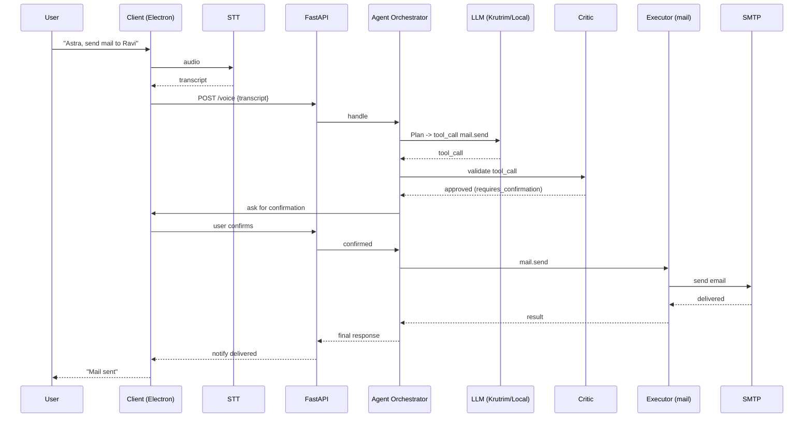
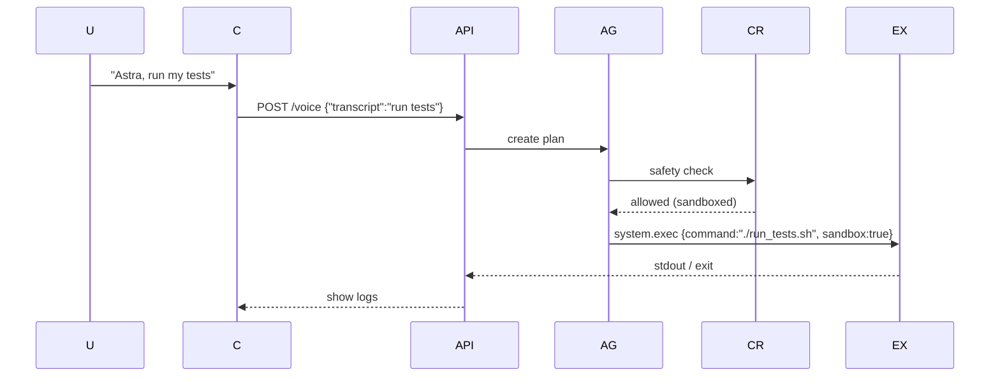

# Astra — Voice-First Agentic Assistant

> **Project:** Astra — a voice-first, agentic personal assistant (Jarvis-level) that understands context, reasons with multi-agent architecture, executes safe system actions, sends emails, searches the web, schedules reminders, controls files and apps, and remembers you over time.

---

## Table of Contents

1. Overview
2. Feature list (v1 + advanced)
3. Tech stack (free-first + optional cloud)
4. High-Level Design (HLD)

   * Goals & non-goals
   * Architecture diagram (Mermaid)
   * Data flow
5. Low-Level Design (LLD)

   * Component responsibilities
   * API contracts (REST/websocket)
   * Database schema
   * Agent design & prompt strategy
   * Tool interface specs
   * Sequence diagrams (Mermaid)
6. Requirements (All free / open-source components)
7. Security, Permissions & Safety
8. Dev & Deployment (local / prod) — Docker-first
9. GitHub README (ready-to-use)
10. Next steps and recommended milestones

---

## 1. Overview

Astra is a modular, extensible voice assistant built as a set of cooperating agents. The LLM (Krutrim or free local LLM) performs reasoning and planning; a safe executor service performs actions (mail, file ops, run scripts). Memory uses a vector store; the system is permissioned and logs all actions.

**Primary goals:**

* Accurate voice-to-intent conversion
* Multi-agent reasoning (planner, critic, executor, memory)
* Safe execution of OS and network operations
* Persistent context & memory
* Openness: use free/open-source components where possible

**Non-goals (initial):**

* Physical holographic UI
* Unsupported enterprise SSO integrations (can be added later)

---

## 2. Feature list

### Core (v1 — must-have)

* Wake-word / push-to-talk voice input
* STT (Whisper or Vosk)
* LLM-based intent & plan generation (Krutrim or local LLaMA family)
* Send/draft emails (SMTP/Gmail OAuth)
* Web search & summarization
* File & system control (sandboxed)
* Reminders & scheduling
* Persistent memory (vector store)
* Permissions/confirmation for risky actions
* Logs & audit trail

### Advanced (v2+)

* Multi-agent debate (Planner, Executor, Critic, Memory)
* Productivity analytics (time tracking, streaks)
* Mirror mode and Decision Critic
* Voice mood detection
* Coding helper (voice-driven code generation)
* Job search automation (periodic web scraping + summary)
* IoT integration (via MQTT)

---

## 3. Tech stack (free-first + optional cloud)

**Free / OSS-first stack (recommended for students & free deployment):**

* Language: **Python 3.11+** (main orchestration) and/or Node.js (frontend/Electron)
* Web framework / API: **FastAPI** (ASGI)
* Voice STT: **OpenAI Whisper (open-source)** or **Vosk** (lightweight)
* TTS: **Coqui TTS** or **Mozilla TTS** (OSS) or fallback OS TTS
* LLM: **Local LLaMA-family via Ollama or local GGML runtimes** (Llama.cpp, llama.cpp-based builds), or **Mistral/Orca** community models — *fully local*.
* Vector DB: **pgvector (PostgreSQL extension)** or **Milvus / Weaviate (OSS)**
* Database: **PostgreSQL** (with pgvector) for relational + vectors
* Queue/Realtime: **Redis + RQ** or **Redis Streams**
* Agent orchestration: **LangChain (open-source)** or **LangGraph (OSS)** patterns implemented on top of FastAPI
* Desktop UI: **Electron + React + Tailwind** (optional)
* Desktop system control: native Node bindings or Python `subprocess` + sandboxing
* Deployment/container: **Docker / Docker Compose**
* Scheduler: **APScheduler** or cron jobs
* Search scraping: **Playwright** (OSS) or BeautifulSoup + requests (respect robots)

**Optional cloud / paid improvements:**

* LLM cloud: **Krutrim API** (cloud) — easier, better inference; **OpenAI** as fallback
* TTS: ElevenLabs (paid) for higher-quality voices
* Hosted vector DB: Pinecone (paid)

> The doc focuses on the **free-first** stack; cloud options are marked optional.

---

## 4. High-Level Design (HLD)

### Goals & constraints

* Modularity: Each capability must be a discrete "tool" with a well-defined interface.
* Safety: All actions require an explicit authorization model.
* Offline-capable: Basic features should work locally without cloud.
* Extensible: New tools (calendar, IoT) can be plugged in.

### Component Overview (short)

* **Client**: Voice capture + UI (Electron/React or mobile) — push-to-talk / wake-word
* **API Gateway**: FastAPI — receives STT text and routes requests
* **STT Service**: Whisper/Vosk for audio→text
* **Agent Orchestrator**: Orchestration layer that calls LLM and local agents
* **Tool Executor**: Executes whitelisted OS / network operations (mail, file, search)
* **Memory Service**: Vector store + relational DB
* **Scheduler**: Reminders & periodic tasks
* **Auth / Permissions**: Local user accounts & tokens
* **Logger / Audit Trail**: Immutable logs of actions and confirmations

### Architecture Diagram (Mermaid)

```mermaid
flowchart LR
  A[User Voice Input (Electron)] -->|audio| B(STT Service - Whisper)
  B -->|text| C[API Gateway (FastAPI)]
  C --> D[Agent Orchestrator]
  D --> E[LLM (Krutrim or Local LLM)]
  D --> F[Memory Service (Postgres + pgvector)]
  D --> G[Tool Executor (mail,file,os,search)]
  G --> H[External Services (SMTP, Google, Web)]
  F --> D
  E --> D
  G --> C
  C -->|voice response| I[TTS Service]
  I -->|audio| A
```

### Data flow (brief)

1. Client captures audio -> sends to STT -> text.
2. API receives text, fetches relevant memory vectors, composes prompt.
3. LLM returns plan/intent + tool calls (structured JSON).
4. Orchestrator validates plan with Critic agent, checks permissions.
5. Executor runs allowed tools; results are stored and summarized.
6. TTS returns spoken result to user.

---

## 5. Low-Level Design (LLD)

### 5.1 Component responsibilities

**Client (Electron/React)**

* Capture audio, show waveform, show transcripts.
* Display conversation history.
* Provide UI for permission management and logs.

**API Gateway (FastAPI)**

* `/api/v1/voice` (websocket/http) — receive transcripts.
* `/api/v1/command` — submit natural language intent.
* `/api/v1/tools/*` — tool endpoints (internal)
* Auth: JWT for local user.

**STT Service**

* Runs Whisper/Vosk as a container or local process.
* Returns confidence and timestamps.

**Agent Orchestrator**

* Layers: Intent extraction -> Memory retrieval -> Planner -> Critic -> Executor.
* Uses an LLM client adapter (Krutrim / local) returning structured function calls.

**Tool Executor**

* Each tool exposes a small API: `run(args) -> Result`.
* Tools reside in a tool registry and are whitelisted in config.
* Example tools: `mail.send`, `file.create`, `system.exec`, `search.web`.

**Memory Service**

* Stores conversation history (table `messages`), semantic vectors, and key user facts.
* Uses pgvector extension for retrieval by cosine similarity.

**Scheduler**

* Uses APScheduler to enqueue reminders that are persisted to DB.

**Logger**

* Append-only logs stored in Postgres; optionally shipped to local files.

---

### 5.2 API Contracts (example)

#### `POST /api/v1/voice` (client -> server)

Request JSON:

```json
{
  "user_id": "user_123",
  "transcript": "Astra, send mail to Ravi saying I'll join tomorrow",
  "locale": "en-IN",
  "context_id": "conv_456" // optional
}
```

Response:

```json
{
  "status":"accepted",
  "task_id":"task_789",
  "estimated_ops":["mail.send"]
}
```

#### Internal: LLM tool call format (structured JSON)

```json
{
  "type":"tool_call",
  "tool":"mail.send",
  "args":{
    "to":"ravi@example.com",
    "subject":"Joining update",
    "body":"Hi Ravi, I will join tomorrow. Regards, Hari"
  }
}
```

**Important:** The orchestrator MUST validate `tool_call` output before executing.

---

### 5.3 Database schema (simplified)

```mermaid
erDiagram
  USERS ||--o{ MESSAGES : has
  USERS ||--o{ MEMORIES : owns
  MESSAGES {
    uuid id PK
    uuid user_id FK
    text
    created_at
    role
  }
  MEMORIES {
    uuid id PK
    uuid user_id FK
    text
    vector
    tags
    created_at
  }
  REMINDERS {
    uuid id PK
    uuid user_id FK
    text
    cron
    next_run
  }
```

SQL tables (sketch):

* `users(id, username, hashed_password, email)`
* `messages(id, user_id, role, text, metadata_json, created_at)`
* `memories(id, user_id, text, embedding_vector, tags, created_at)`
* `reminders(id, user_id, text, schedule, next_run, active)`
* `actions_log(id, user_id, action_type, payload, confirmed_by_user, created_at)`

---

### 5.4 Agent design & prompt strategy

**Agents**:

* **Perception** (parses transcripts, normalizes time, extracts entities)
* **Memory** (retrieves relevant facts)
* **Planner** (creates step-by-step plan and chooses tools)
* **Critic** (checks safety, permission, contradictions)
* **Executor** (performs the action)

**Prompt pattern** (short):

```
SYSTEM: You are Astra's Planner. You receive: user_text, recent_memory, available_tools.
INSTRUCTIONS: Produce JSON with keys: intent, confidence, steps[], tool_calls[].
CONSTRAINTS: Never delete files without explicit confirmation. If action is risky, return requires_confirmation=true.

USER_TEXT: "Send mail to Ravi saying I'll join tomorrow"
RECENT_MEMORY: [ ... ]
```

**Example Planner output**:

```json
{
  "intent":"send_email",
  "confidence":0.94,
  "requires_confirmation":true,
  "tool_calls":[{"tool":"mail.send","args":{"to":"ravi@example.com","subject":"Joining update","body":"Hi Ravi..."}}]
}
```

The Critic then inspects `tool_calls` and applies policies.

---

### 5.5 Tool interface specs (example)

Each tool implements:

```python
class Tool:
    name: str
    def validate(self, args) -> (bool, message):
    def run(self, args, user_context) -> ToolResult:
```

**mail.send** args: `to`, `subject`, `body`, `cc[]`, `bcc[]`, `send_now`.
**system.exec** args: `command`, `sandbox=True|False` (sandbox default True).
**search.web** args: `query`, `num_results`.

All run results are returned as structured JSON and persisted in `actions_log`.

---

### 5.6 Sequence diagrams (Mermaid)

**Send Email Flow**



**Run a Local Script (sandbox)**



---

## 6. Requirements (All free / open-source options)

**Runtime & language**

* Python 3.11+ (free)
* Node.js 18+ (for frontend)

**Core OSS components**

* FastAPI (API)
* uvicorn (ASGI server)
* PostgreSQL + pgvector (vector store)
* Redis (for queue, caching)
* Whisper (OpenAI : OSS weights) or Vosk (lightweight STT)
* Coqui TTS (OSS) or system TTS
* LangChain / custom orchestration library (OSS)
* Playwright / BeautifulSoup for scraping (adhere to robots.txt)
* Electron, React, Tailwind (desktop UI)
* Docker, Docker Compose

**Development tools**

* Git, GitHub (free)
* pytest (testing)

**Notes on Krutrim vs fully-free**

* **Krutrim**: cloud LLM (may be paid). You can implement an adapter to call Krutrim if you have API keys. For a fully free stack, use local LLMs (Llama2-based models via `llama.cpp` or `ollama` if available) — inference quality will vary but functional.

---

## 7. Security, Permissions & Safety

* **Permissions model**: per-tool scope mapped to user roles. Example scopes: `mail.send`, `system.exec:sandbox`, `system.exec:unsafe`.
* **Confirmations**: any destructive or network action must request explicit confirmation.
* **Auditing**: persist `actions_log` with `confirmed_by_user` flag.
* **Isolation**: sandbox system.exec using containers (Docker) or restricted user accounts.
* **Secrets**: store API keys (SMTP/Gmail, Krutrim) in `.env` and a secrets manager for deployment.
* **Rate limiting**: protect LLM endpoints and tools from runaway loops.

---

## 8. Dev & Deployment (local → prod)

### Local dev (Docker Compose)

* Services:

  * `postgres` (with pgvector extension)
  * `redis`
  * `fastapi` app
  * `stt` worker (whisper/vosk)
  * `executor` worker
  * `electron` client (local dev mode)

### Production

* Use docker images and deploy to a VPS (e.g., a small Linode/Hetzner) or a cloud provider. For persistence, attach volumes for Postgres and Redis. Use systemd / Docker Compose or Kubernetes for scale.

**Important:** Keep an option to run entirely local without cloud LLMs so the system works offline (limited features).

---

## 9. GitHub README (copy-paste ready)

````markdown
# Astra — Voice-First Agentic Assistant

Astra is a modular voice-first AI assistant built with open-source components. It performs multi-agent reasoning, executes whitelisted tools (send email, run scripts, search the web), and keeps persistent memory.

## Key features
- Voice input (Whisper / Vosk)
- LLM-based planning (Krutrim or local LLM)
- Tool execution (mail, file, system commands)
- Memory (Postgres + pgvector)
- Multi-agent workflow (Planner / Critic / Executor)

## Tech stack
- Python + FastAPI
- PostgreSQL + pgvector
- Redis for queues
- Whisper / Vosk for STT
- Coqui TTS for speech
- Local LLM via Ollama / llama.cpp (or Krutrim API)
- Electron + React for desktop UI

## Quickstart (dev)
1. Clone repo
```bash
git clone https://github.com/your-username/astra.git
cd astra
````

2. Copy `.env.example` to `.env` and fill in local credentials (SMTP, optional Krutrim)
3. Start Docker Compose

```bash
docker compose up --build
```

4. Open the Electron client in dev mode

```bash
cd client
npm install
npm run dev
```

## Configuration

* `.env` contains keys: `DATABASE_URL`, `REDIS_URL`, `SMTP_URL`, `LLM_PROVIDER=local|krutrim`, `KRUTRIM_API_KEY`

## Contributing

* Follow the repo structure and send PRs

## License

MIT

````

---

## 10. Next steps & milestones (30/60/90 suggested)

**Week 1 — MVP**
- Initialize repo, Docker Compose, and basic FastAPI server
- Implement STT pipeline and simple echo flow
- Add user auth and simple memory table

**Week 2 — Tools & LLM**
- Implement mail.send tool (SMTP)
- Integrate LLM adapter (local or Krutrim)
- Build Planner + simple tool call execution

**Week 3 — Safety & UI**
- Add Critic & confirmation flow
- Build Electron client with push-to-talk
- Add logs & action audit

**Month 2**
- Add vector memory and similarity retrieval
- Add search.web tool and summarization
- Add reminders and scheduler

**Month 3**
- Multi-agent debate and productivity analytics
- Mirror/Decision Critic modes and mood detection
- Polish UI and package release

---

### Appendix: Useful Code Snippets
**LLM adapter (sketch)**
```python
class LLMAdapter:
    def __init__(self, provider, config):
        self.provider = provider
        self.config = config
    def plan(self, prompt, memory=[]):
        if self.provider == "krutrim":
            return call_krutrim_api(prompt, self.config)
        else:
            return call_local_llm(prompt, self.config)
````

**Tool runner sketch**

```python
def run_tool(user, tool_name, args):
    tool = TOOL_REGISTRY.get(tool_name)
    ok, msg = tool.validate(args)
    if not ok:
        return {"status":"invalid","reason":msg}
    # require confirmation if tool requires
    if tool.requires_confirmation and not args.get("confirmed"):
        return {"status":"requires_confirmation"}
    result = tool.run(args, user)
    log_action(user.id, tool_name, args, result)
    return {"status":"ok","result":result}
```

---

**That's the full HLD + LLD + free requirements + README + diagrams.**

If you want, I can next:

* Generate the project skeleton (Docker Compose + FastAPI + example tools)
* Produce a ready-to-run `docker-compose.yml` and `.env.example`
* Create prioritized GitHub issues and milestone board

Tell me which one to generate first and I'll produce the code skeleton in the repo.
